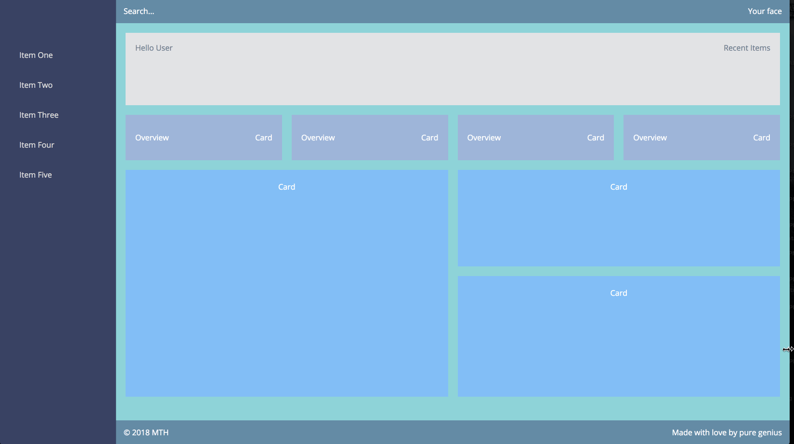

# Dashboard Card

## Introduction:

- About the project: This project aims to create a modern, responsive dashboard layout using CSS Grid and Flexbox, without any framework.
- Project goal:
  1. Provide me with the knowledge and skills needed to design and develop a beautiful, fully functional dashboard page that is both responsive and visually appealing.
  2. Learn how to create a layout that adapts to different screen sizes and devices, making it fully responsive.
  3. Learn how to incorporate a sliding side navigation that enhances the user experience and provides easy access to all the necessary information.

 

## Overview:

 

## Study Notes:

- `align-items` property: y-axis
  - `align-items: flex-start;` positions items at the beginning of the container.
  - `align-items: center;` positions items at the center of the container.
  - `align-items: flex-end;` positions items at the end of the container.
  - [demo all](https://www.w3schools.com/cssref/playdemo.php?filename=playcss_align-items)
- `justify-content` property: x-axis
  - `justify-content: flex-start;` positions items at the beginning of the container.
  - `justify-content: center;` positions items at the center of the container.
  - `justify-content: flex-end;` positions items at the end of the container.
  - `ustify-content: space-between;` will have equal spaces between items.
  - `ustify-content: space-around;` will have equal spaces around items.
  - `ustify-content: space-evenly;` all spaces are equal.
  - [demo all](https://www.w3schools.com/cssref/playdemo.php?filename=playcss_justify-content)
- `flex-direction` property:
  - `flex-direction: row` displays items horizontally as a row.
  - `flex-direction: row-reverse` displays items in reverse order as a row.
  - `flex-direction: column` displays items vertically as a column.
  - `flex-direction: column-reverse` displays items in reverse order as a column.
  - [demo all](https://www.w3schools.com/cssref/playdemo.php?filename=playcss_flex-direction&preval=row)
- `list-style-type` property:
  - `list-style-type: none;` no marker is shown.
  - `list-style-type: disc;` filled circle (default).
  - `list-style-type: circle;` marker is a circle.
  - `list-style-type: square;` marker is a square.
  - [demo all](https://www.w3schools.com/cssref/playdemo.php?filename=playcss_list-style-type)
- `cursor` property [demo](https://www.w3schools.com/cssref/tryit.php?filename=trycss_cursor)
- `grid-auto-rows` property [demo](https://www.w3schools.com/cssref/playdemo.php?filename=playcss_grid-auto-rows)
- `grid-auto-flow` property controls how auto-placed items get inserted in the grid (prevent any empty row spaces due to different image heights), [demo](https://www.w3schools.com/cssref/playdemo.php?filename=playcss_grid-auto-flow&preval=dense)
- grid-template-columns: repeat(
  auto-fit,
  minmax(265px, 1fr)
  );
  - if cards go above 265px in width, they will wrap to another row;
  - if cards go below 265px in width, they will stretch to take up the available remaining container width;
  - when cards wrap to a new row (auto-fit), they will line up from left to right with the cards above them, matching their widths.
- `-webkit-column-break-inside: avoid;` prevents breaking an element (for example, a card) across multiple columns when using a multi-column layout, even if there is not enough space for the entire card to fit.
- `box-sizing: border-box` tells the browser to include padding and border widths in the total width and height of an element.
